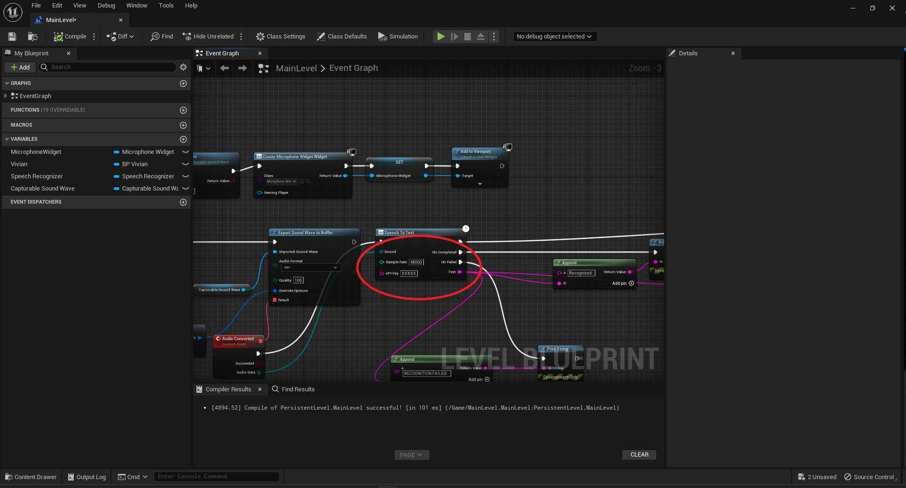
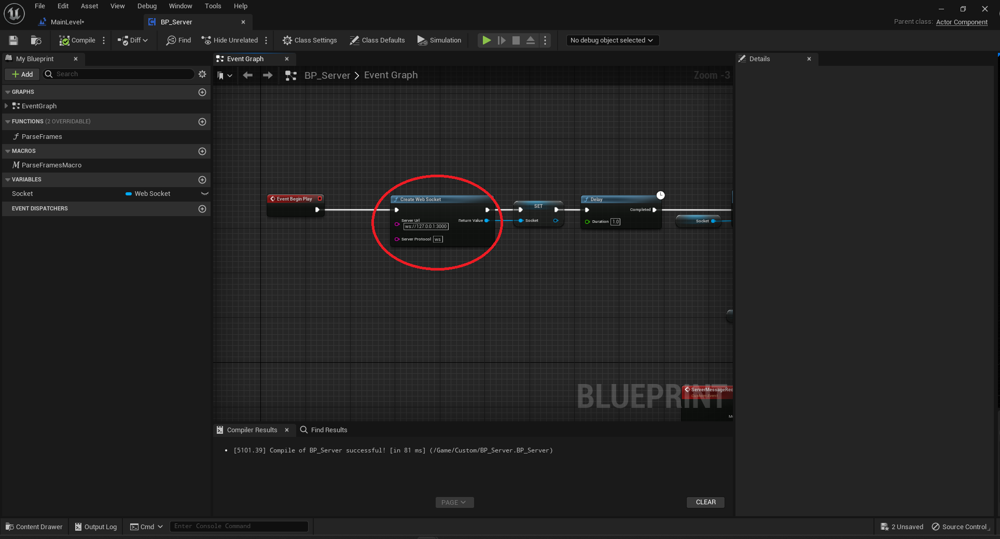

If you find this project useful, consider buying me a coffee!

[](https://www.buymeacoffee.com/keenua)

# Running locally

## Checking out the repositories

```
mkdir assistant
cd assistant
git clone https://github.com/keenua/assistant
git clone https://github.com/keenua/assistant-server-py
```

## Server configuration

- Make a copy of `example.env` and rename it to `.env`
- Go to [Eleven Labs](https://elevenlabs.io/app/subscription) and copy the API key
- Paste it into `.env` file with the key `ELEVENLABS_API_KEY`
- Go to [Open AI](https://platform.openai.com/api-keys) and copy the API key
- Paste it into `.env` file with the key `OPENAI_API_KEY`

## Server installation

Install conda: https://conda.io/projects/conda/en/latest/user-guide/install/index.html
I'm using miniconda both on windows and linux, but you can use anaconda if you prefer

- Create a new environment from the environment.yml file
```shell
conda env create -f environment.yml
```

If you're running the server on linux, use:
```shell
conda env create -f environment.linux.yml
```

- Activate environment
```shell
conda activate assistant
```

- Install sox
```shell
conda install -c conda-forge sox
```

- Download the allosaurus model:
```bash
python -m allosaurus.bin.download_model -m eng2102
```

## Running the server

```bash
python -m assistant_server.server
```

## Unreal engine project configuration

- Go to [Google Cloud Console](https://console.cloud.google.com)
- [Create a new project](https://console.cloud.google.com/projectcreate) or use an existing one
- Enable the [Cloud Speech-to-Text API](https://console.cloud.google.com/apis/api/speech.googleapis.com)
- [Create a new API key](https://console.cloud.google.com/apis/credentials) and copy it
- Open `assistant` project in Unreal Engine 5
- When asked about rebuilding the project, click yes
- Go to the [main level blueprint](https://forums.unrealengine.com/t/how-to-open-level-blueprint-in-ue5/525760)
- Paste your API key into `API key` variable of the `Speech To Text` node



- Compile and save the blueprint
- [Optional] If you're running the server on a different machine, open the `BP_Server` blueprint from `/Content/Custom/BP_server.uasset` and change the `Server URL` variable in the `Create Web Socket` node to match the IP address of the server machine. Example: `ws://192.168.0.1:3000`



## Running the Unreal Engine project

- Make sure the server is running
- Run the project (Alt+P) in Unreal Engine
- Hold `Space` to talk to the assistant

# Testing

## Generate sample bvh

```bash
python .\assistant_server\gesture_generation\generate.py -a .\data\samples\barefoot.wav -o .\data\zeggs\options.json -s .\data\zeggs\styles\old.bvh
```

Results should be in `data/results`

## Sample gpt

```bash
python .\assistant_server\api_clients\gpt.py
```

## Sample tts

```bash
python .\assistant_server\api_clients\speech.py
```


## Troubleshooting

If running on Vultr, check if cuda is available by running:

```python
import torch
torch.cuda.is_available()
```

If it returns `False`, run:

```bash
sudo bash /opt/nvidia/drivers/linux_nvidia_client.run --ui=none --no-questions
```